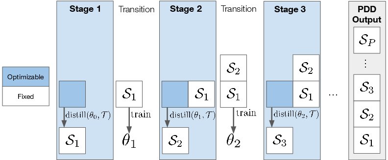

# Data Distillation Can Be Like Vodka: Distilling More Times For Better Quality

This is the official repository for the paper [Data Distillation Can Be Like Vodka: Distilling More Times For Better Quality](https://openreview.net/forum?id=1NHgmKqOzZ) (ICLR 2024) by Xuxi Chen*, Yu Yang*, Zhangyang Wang, Baharan Mirzasoleiman.

## Abstract

Dataset distillation aims to reduce the time and memory requirement of training deep networks on large datasets by synthesizing a small number of synthetic images that can provide a similar generalization performance to that of the full data. Despite the recent efforts, existing dataset distillation methods suffer from a significant performance gap compared to training on the original data. In this work, we argue that distilling the entire data into one synthetic subset cannot achieve a superior generalization performance. This is because the training dynamics of deep networks drastically change during the training. Hence, multiple synthetic subsets are required to capture the training dynamics at different phases of training. To improve the distillation performance, we propose progressive dataset distillation (PDD), which synthesizes multiple small sets of synthetic images conditioned on the previous ones and trains the model on the union of the subsets generated so far. Our extensive experiments show that PDD can effectively improve the performance of existing dataset distillation methods by up to 4.3%. In addition, our method for the first time enable generating considerably larger synthetic datasets.



## Installation

This code is tested with Python 3.9.7, PyTorch 1.11 and CUDA 11.3. The commands to install the packages is

```bash
pip install torch==1.11.0+cu113 torchvision==0.12.0+cu113 torchaudio==0.11.0 --extra-index-url https://download.pytorch.org/whl/cu113
pip install -r requirements.txt
```

## Experiments

### Experiments with MTT

#### Pre-trained weights and distilled images (PDD+MTT)

The buffers can be found in [this link](https://drive.google.com/drive/folders/1ZKamN6ledxEnmLyya4Mbl57Fu_H1Axb6?usp=sharing).

The distilled images can be found in [this link](https://drive.google.com/drive/folders/1OKnCiKO78-MOuMXRJWGyE3uV69t2kIMV?usp=sharing).

#### Commands (PDD+MTT)

The first step is to create the buffers that hold the trajectories.

```bash
python buffer_mtt.py --dataset=CIFAR10 --model=ConvNet --train_epochs=50 --num_experts=100 --zca --data_path=data
```

For other datasets, please replace the string after `--dataset=`.

Subsequently, please run the following commands for CIFAR-10:

```bash
# IPC=10 (P=5)
CUDA_VISIBLE_DEVICES=0 python distill_mtt.py --dataset=CIFAR10 --model=ConvNet --ipc=2 --syn_steps=50 --expert_epochs=2 --max_start_epoch=5 --zca --lr_img=1000 --lr_lr=1e-07 --lr_teacher=0.01 --num_intervals 5 --root_log_dir logged_files 

# IPC=50 (P=5)
CUDA_VISIBLE_DEVICES=0 python distill_mtt.py --dataset=CIFAR10 --model=ConvNet --ipc=10 --syn_steps=30 --expert_epochs=2 --max_start_epoch=15 --zca --lr_img=1000 --lr_lr=1e-05 --lr_teacher=0.01 --num_intervals 5 --root_log_dir logged_files
```

Similarly, the commands for CIFAR-100 are presented below:

```bash
# IPC=10 (P=5)
CUDA_VISIBLE_DEVICES=0 python distill_mtt.py --dataset=CIFAR100 --model=ConvNet --ipc=2 --syn_steps=20 --expert_epochs=3 --max_start_epoch=20 --zca --lr_img=1000 --lr_lr=1e-05 --lr_teacher=0.01 --num_intervals 5 --root_log_dir logged_files 

# IPC=50 (P=5)
CUDA_VISIBLE_DEVICES=0 python distill_mtt.py --dataset=CIFAR100 --model=ConvNet --ipc=10 --syn_steps=20 --expert_epochs=2 --max_start_epoch=20 --zca --lr_img=1000 --lr_lr=1e-05 --lr_teacher=0.01 --num_intervals 5 --root_log_dir logged_files --batch_syn 512 
```

For evaluation, please run:

```bash
CUDA_VISIBLE_DEVICES=0 python evaluate_mtt.py --dataset=CIFAR10 --model=ConvNet --ipc=2 --syn_steps=50 --expert_epochs=2 --max_start_epoch=5 --zca --lr_img=1000 --lr_lr=1e-07 --lr_teacher=0.01 --num_intervals 5 --num_experts 5 --override_load_path CIFAR10_ConvNet_S_ipc2_max5_syn50_real2_img1000.0_1e-07_0.01_increase_zca --save_path logged_files --epoch_eval_train 500

CUDA_VISIBLE_DEVICES=0 python evaluate_mtt.py --dataset=CIFAR10 --model=ConvNet --ipc=10 --syn_steps=20 --expert_epochs=2 --max_start_epoch=15 --zca --lr_img=1000 --lr_lr=1e-05 --lr_teacher=0.01 --num_intervals 5 --num_experts 5 --override_load_path CIFAR10_ConvNet_S_ipc10_max15_syn30_real2_img1000.0_1e-05_0.01_increase_zca --save_path logged_files --epoch_eval_train 500

CUDA_VISIBLE_DEVICES=0 python evaluate_mtt.py --dataset=CIFAR100 --model=ConvNet --ipc=2 --syn_steps=20 --expert_epochs=3 --max_start_epoch=20 --zca --lr_img=1000 --lr_lr=1e-05 --lr_teacher=0.01 --num_intervals 5 --num_experts 5 --override_load_path CIFAR100_ConvNet_S_ipc2_max20_syn20_real3_img1000.0_1e-05_0.01_increase_zca --save_path logged_files --epoch_eval_train 500

CUDA_VISIBLE_DEVICES=0 python evaluate_mtt.py --dataset=CIFAR100 --model=ConvNet --ipc=10 --syn_steps=20 --expert_epochs=2 --max_start_epoch=20 --zca --lr_img=1000 --lr_lr=1e-05 --lr_teacher=0.01 --num_intervals 5 --num_experts 5 --override_load_path CIFAR100_ConvNet_S_ipc10_max20_syn20_real2_img1000.0_1e-05_0.01_increase_zca --save_path logged_files --epoch_eval_train 500
```

#### Tiny-Imagenet

First, please prepare the Tiny ImageNet dataset under the `data` folder. The next step is to generate the buffers:

```bash
python buffer.py --dataset Tiny --model=ConvNetD4 --train_epochs 24  --data_path data/tiny-imagenet-200
```

For distillation, please run

```bash
python distill_increase.py --dataset=Tiny --model=ConvNetD4 --ipc=2 --syn_steps=20 --expert_epochs=2 --max_start_epoch=20 --lr_img=10000 --lr_lr=1e-04 --lr_teacher=0.01 --num_intervals 5 --data_path data/tiny-imagenet-200 --batch_syn 64 # ipc10
python distill_increase.py --dataset=Tiny --model=ConvNetD4 --ipc=10 --syn_steps=20 --expert_epochs=2 --max_start_epoch=20 --lr_img=10000 --lr_lr=1e-04 --lr_teacher=0.01 --num_intervals 5 --data_path data/tiny-imagenet-200 --batch_syn 64 # ipc50
```

For evaluation, please run

```bash
CUDA_VISIBLE_DEVICES=0 python evaluate_mtt.py --dataset=Tiny --model=ConvNetD4 --ipc=2 --syn_steps=20 --expert_epochs=2 --max_start_epoch=20 --lr_img=10000 --lr_lr=1e-04 --lr_teacher=0.01 --num_intervals 5 --data_path data/tiny-imagenet-200 --num_intervals 5 --override_load_path Tiny_ConvNetD4_S_ipc2_max20_syn20_real2_img10000.0_0.0001_0.01_increase  --epoch_eval_train 500 --save_path logged_files

CUDA_VISIBLE_DEVICES=0 python evaluate_mtt.py --dataset=Tiny --model=ConvNetD4 --ipc=10 --syn_steps=20 --expert_epochs=2 --max_start_epoch=20 --lr_img=10000 --lr_lr=1e-04 --lr_teacher=0.01 --num_intervals 5 --data_path data/tiny-imagenet-200 --num_intervals 5 --override_load_path Tiny_ConvNetD4_S_ipc10_max20_syn20_real2_img10000.0_0.0001_0.01_increase  --epoch_eval_train 500 --save_path logged_files
```

### Experiments with IDC

#### Pre-trained weights and distilled images (PDD+IDC)

The distilled images can be found in the following [link](https://drive.google.com/drive/folders/1uyrRHFt5MX_cnZFKOFJ8ouE_Vtt7_Fg9?usp=sharing).

### Commands (PDD+IDC)

To distill images from CIFAR-10, please run

```bash
# IPC=10 (P=5)
CUDA_VISIBLE_DEVICES=0 python -u distill_idc.py --reproduce  -d cifar10 -f 2 --ipc 2 --data_dir data --tag progressive --start-interval 0 --niter 2000 

# IPC=50 (P=5)
CUDA_VISIBLE_DEVICES=0 python -u distill_idc.py --reproduce  -d cifar10 -f 2 --ipc 10 --data_dir data --tag progressive --start-interval 0 --niter 2000 
```

Similarly for CIFAR-100, please run

```bash
CUDA_VISIBLE_DEVICES=0 python -u distill_idc.py --reproduce  -d cifar100 -f 2 --ipc 2 --data_dir data --tag progressive --start-interval 0 --niter 2000 

CUDA_VISIBLE_DEVICES=0 python -u distill_idc.py --reproduce  -d cifar100 -f 2 --ipc 10 --data_dir data --tag progressive --start-interval 0 --niter 1000 
```

## Todos


## Acknowledgement

Our code is built based on the following repositories:

- [MTT](https://github.com/GeorgeCazenavette/mtt-distillation)
- [IDC](https://github.com/snu-mllab/Efficient-Dataset-Condensation)
